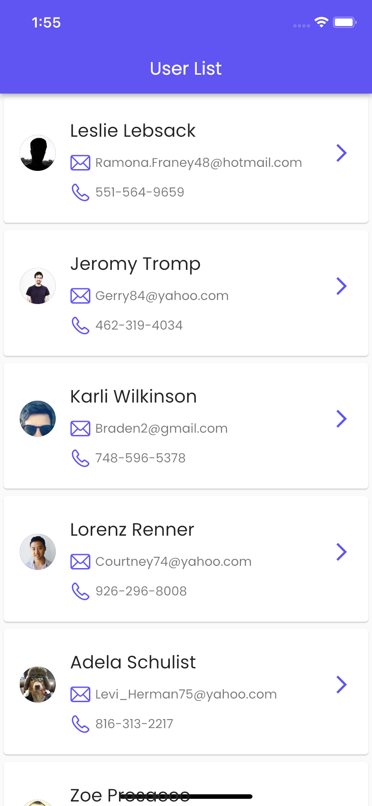
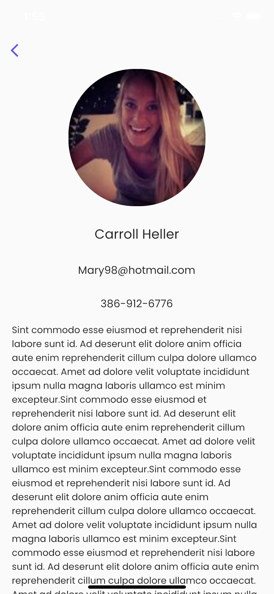

# User List Project
It is a flutter application where you can see the user's list and details.

## Tech and Libraries

- MVVM Architecture
- State Management: [Get](https://pub.dev/packages/get)
- Network: [Dio](https://pub.dev/packages/dio) 
- Navigation: [Get](https://pub.dev/packages/get#route-management)
- Font: [Google Fonts](https://pub.dev/packages/google_fonts)
- Context Extension: [Kartal](https://pub.dev/packages/kartal)

## Screenshots

<table> 
  <tr align="center">
    <td colspan="2">Screens</td>
</tr>
  <tr align="center">
    <td></td>
    <td></td>
  </tr>
</table>